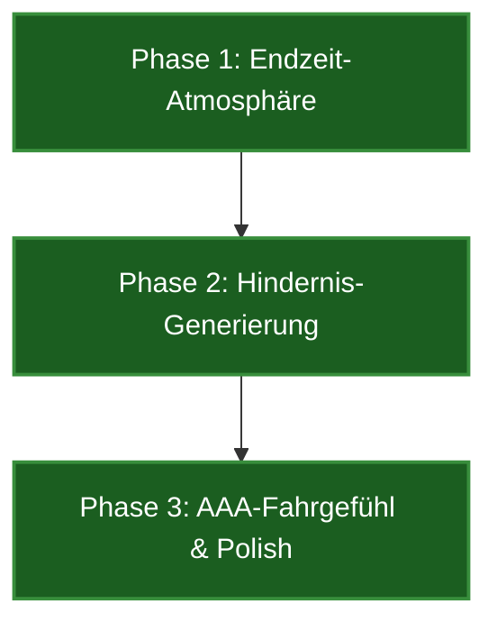

# Apocalypse Drive: Entwicklungs-Roadmap

Dieses Dokument beschreibt die Meilensteine und Entwicklungsphasen zur Umwandlung des 3D-Universums in ein atmosphärisches, apokalyptisches 3D-Fahrspiel.

---

## 🗺️ Phasenübersicht

---

## 🌪️ Phase 1: Düstere Endzeit-Atmosphäre (✅ VOLLSTÄNDIG UMGESETZT)
Ziel ist der visuelle Umbau von einem heiteren Tageslicht-Plaza zu einem düsteren, bedrohlichen Ödland.
* **Tiefschwarzer/Düsterer Aschehimmel:** Ersetzen des hellblauen Himmels durch eine dichte, kohleschwarze und rot-orange glimmende Rauchkuppel (Aschewolken-Simulation). (Erfolgreich implementiert über custom GLSL Sky-Shader).
* **Dichter Bodennebel:** Erhöhung des Fog-Density-Werts und Nebelanpassung auf ein aschiges Dunkelbraun (`#130e0b`, Dichte `0.024`) zur drastischen Reduzierung der Weitsicht.
* **Zerstörte PBR-Asphalt-Textur:** Farbanpassung der Bodenebene auf ein staubiges, verwittertes Dunkelgrau/Anthrazit. Erhöhung der Normal/Bump-Werte, um Risse, Brüche und Krater plastisch und tief wirken zu lassen.
* **Atmosphärische Lichtstimmung:** Dimmen des globalen Sonnenlichts auf ein schwaches, schmutzig-rotes Restglimmen am Horizont und Hinzufügen von Punktlichtern (orangefarbenes Glut-Licht am Asphalt, Cyan Chassis-Underglow).

## 🏚️ Phase 2: Generierung von Hindernissen (✅ VOLLSTÄNDIG UMGESETZT)
Erstellung einer abwechslungsreichen, zerstörten Stadtlandschaft komplett aus Code-Geometrien (keine externen Assets).
* **Low-Poly-Gebäuderuinen:**
  - Prozedurale Erzeugung von kantigen, asymmetrischen Ruinenblöcken (zerstörte Wolkenkratzer, Betonpfeiler).
  - Einsatz von tilted Slabs (zerbrochene Deckenplatten) und verbogenen Metallträgern (Rebars).
  - Zufällige Platzierung von ca. 32 Ruinen auf der Plaza (außerhalb der Startzone).
* **Abgestorbene, astlose Bäume:**
  - Prozedurale Generierung von verzweigten, schwarzen Baumstämmen aus verjüngten Zylindridgeometrien.
  - Zufällige Platzierung von 55 Bäumen im Gelände.
* **Kollisionsnetzwerk:**
  - Integration aller generierten Ruinen und Bäume in die Bounding-Box-Kollisionsprüfung von `app.js`, sodass das Auto realistisch mit ihnen kollidiert (Abprall-Impuls, Geschwindigkeitsverlust).

## 🏎️ Phase 3: AAA-Fahrgefühl & Polish (✅ VOLLSTÄNDIG UMGESETZT)
Verfeinerung des Steuerungsverhaltens und spektakuläre visuelle Effekte.
* **Dynamic Camera Shake (Kamera-Wackeln):**
  - Implementierung eines hochfrequenten Shaking-Effekts der Kamera bei hoher Fahrgeschwindigkeit (ab 15 m/s), um die Vibration des Motors und das Fahren über Trümmer physisch spürbar zu machen.
* **Reifen-Staubpartikel (Wheel Dust System):**
  - Dynamisches Generieren von aufgewirbeltem Aschestaub (grau-braune Partikel aus einer performanten Pool-Struktur) hinter den beiden Hinterreifen, sobald das Auto beschleunigt, lenkt oder driftet.
* **Drift-Visualisierung & Handling:**
  - Hinzufügen von temporär abreibenden, fading Reifenspuren (Skidmarks) auf dem Asphalt an den Drift-Positionen der Reifen (mit Distanzprüfung für lückenfreie Verbindung).
  - Verfeinerter Handbremsdrift (Shift-Taste) mit verringertem Grip (Slip-Lerp auf 0.6) für extrem lange, kontrollierte Drifts.
* **Chassis Roll & Pitch (Karosserie-Neigung):**
  - Neigen der Karosserie nach außen in Kurven (Z-Achse) und Neigen nach vorn/hinten bei starkem Beschleunigen/Bremsen (X-Achse).
